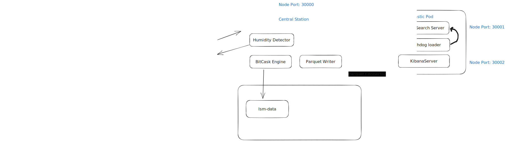
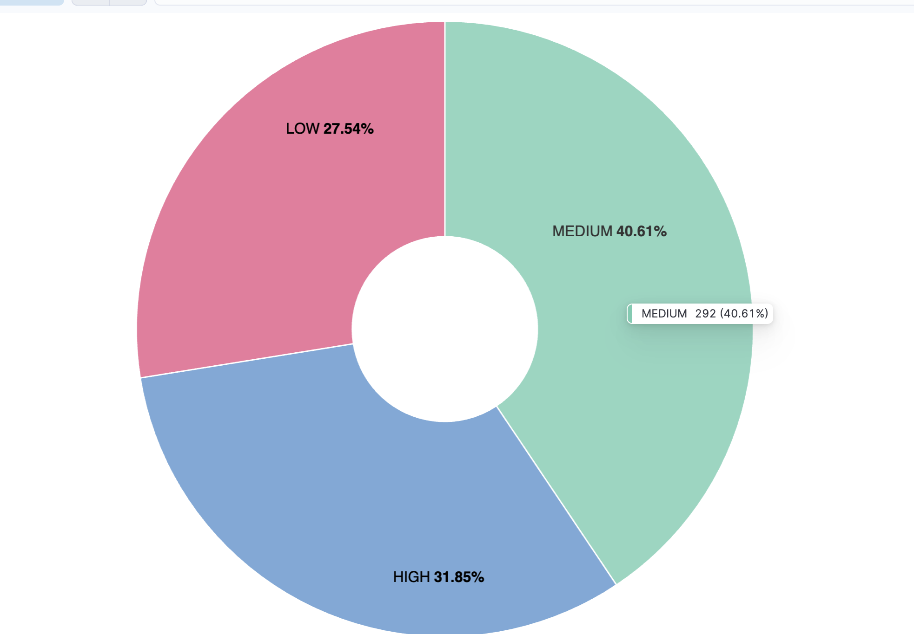

# Weather-Station-Monitoring

## [Demo 💥]()

## System Design

### overview

- Each weather station outputs a status message every 1 second to report its weather status to Kafka.
- The Central Station consumes these weahter status messages does the following:

  - check fo humidity and notify if went above certain level
  - Batch archive data in parquet files
  - Write data to the bitcask lsm

- Then a connector fetches the parquet data into ES to be analyzed by kibana and report battry status like the following
  

### LSM

## Development Installation

- install java 11
- install maven
- run `mvn install `
- install docker
- run `docker compose up -d`
- run `WeatherStationMock.java` and `CentralStation.java`
- verfiy that everything is working by quering kibana by running `GET weather-status/_search` in the dev tools editor or query elastic search directly
